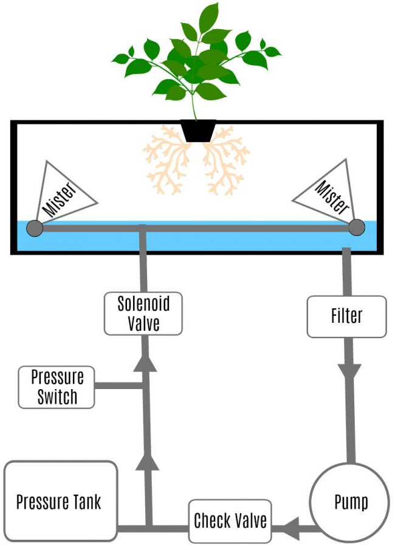

# Aeroponics

This is a Arduino based project used to control an aeroponics system.
The components of the system are outlined in the diagram below.
Operating pressure is between 80-100 PSI, creating water droplets of 40 microns.

 